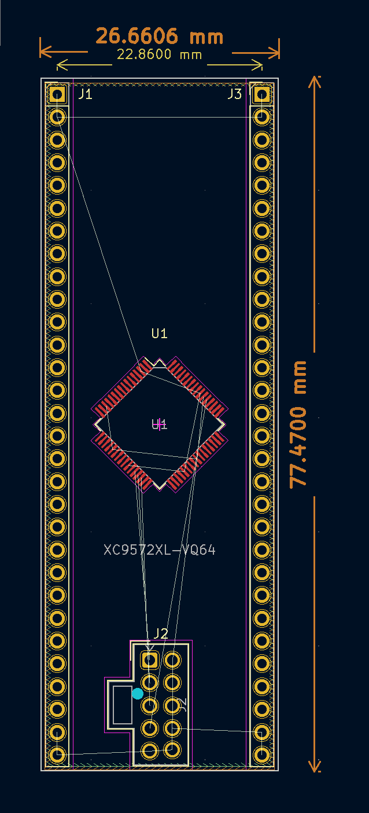

# Aspirational

**Everything in this repo is aspirational. Nothing has been implemented.**

# Licensing

 The content of this repository is licensed under a <a rel="license" href="http://creativecommons.org/licenses/by/4.0/">Creative Commons Attribution 4.0 International License</a>.

# 84CP series

84CP is a series of hardware components for student, experimenter, and hobbyist use. 84CP components are packaged on 3.1" x 1.0" breakout "surfboards". Each component has 60 pins on 0.9" centers with 0.1" traditional (not metric) spacing, allowing one component in a standard 30-pin "small" solderless breadboard or two components in a 64-pin "large" breadboard with one row of breadboard holes open on each side of the component.

The components implement 16-bit slices and include an ALU, 16-bit wide 2:1 multiplexer, registers, controls, random logic, system clock, a VGA adapter, and nonvolatile RAM. 84CP components operate from a 3.3 volt supply, but wide level shifter components are also provided for interfacing with 5 volt logic. All components are designed for use at clock rates up to 10MHz.

Logic components are specializations of AMD Xilinx XC9572XL ("9572") Complex Programmable Logic Device ("CPLD"). A characteristic of CPLDs is that the assignment of functions to pins on the device is performed by the synthesize software, usually leading to arbitrary scrambling of inputs, outputs, control lines, power, and ground. 84CP-series surfboards physically descramble the device pins. Inputs, outputs, and control lines are meaningfully grouped with power and ground at the corners.

The 84CP series is intended for hobbyiest and educational use. All 60 pins protrude upward through the board, making them easily accessible to instrumentation (oscilloscopes and logic analyzers) for debugging and educational use. The pins also allow a single wire wrap directly to the board. Below the board, the pins are long enough for solderless breadboard insertion. Each component includes a top-mount JTAG connector, allowing it to be programmed or reprogrammed at will.

# Planned 84CP series components

- 84CP01 Scrambled baseboard
- 84CP02 Descrambled combinational baseboard with 2 x 16 input, 16 bit output, four control lines, and no clock
- 84CP03 Descrambled clocked baseboard with 16 bit input, 16 bit 3-state output, and multiple control lines
- 84CP04 Descrambled clocked baseboard with 16 bit input, 16 bit output, 16 bit 3-state output, and limited control lines
- 84CP09 Baseboard with 40 MHz clock module and 4-phase 10MHz outputs
- 84CP10 24-bit level shifter with 3 lower-voltage 8-bit enables
- 84CP11 24-bit level shifter with 2 higher-voltage 8-bit enables and 6 always-enabled
- 84CP41 16-bit register unit with 3 registers and five small constants (84CP03 baseboard)
- 84CP42 16 bit register with both 3-state and regular outputs (84CP04 baseboard)
- 84CP71 Four-function ALU with adder (84CP02 baseboard)
- 84CP72 Four-function ALU with subtracter (84CP02 baseboard)
- 84CP73 16 bit 2:1 multiplexer with shifter (84CP02 baseboard)
- 84CP74 ALU flags register and associated logic (similar to 84CP04 baseboard)
- 84CP81 2M x 16 bit nonvolatile static RAM (nonstandard baseboard)
- 84CP91 10MHz 4-phase system clock with 800x600 monochrome VGA adapter (84CP09 baseboard)

# Example 84CP01 Baseboard

# Is the 9572 CPLD obsolete?

The 9572 is a programmable device with up to 72 bits of register storage and more than 1500 equivalent logic gates, not of all which can be used in practice for any particular design. It's available in 44-pin, 64-pin, and 100-pin surface mount packages.

At the cutting edge, CPLD-type devices have been superceded by Field Programmable Gate Arrays (FPGAs) containing enormous amounts of storage and uncommitted logic. Manufacturers prefer to sell denser chips with higher margins, so Xilinx (now AMD Xilinx) has been making efforts to push customers away from the 9572 and its programming software, ISE, for almost a decade.

For a variety of reasons, there has been signficant customer pushback on their efforts.

- CPLDs are signficantly simpler than FPGAs. They had found their way into numerous university engineering programs and are widely used by hobbyists.
- CPLDs use first-generation surface-mount packages like TSOP. Most FPGAs, with their very high external connection counts, are packaged in ball grid and similar packages that are difficult to work with by hand.
- CPLDs are much less expensive than FPGAs. A single 9572 is sufficient to encapsulate many simple logic designs or the entire I/O logic of a fairly complex embedded controller.
- Manufacturers are particularly hesitant to end-of-life programmable components for fear of scaring low- and medium-volume users away from their use in future designs. AMD Xilinx, for example, publicly states that its current FPGA components (such as the Spartan series) will not be end-of-lifed until at least 2035.

No end of life announcement for the 9572 has been made and it's available from all large electronics distributers from under $10 US.

But the second (and mandatory) ingredient of any programmable device is the programming software. Despite some efforts in the open source community, Xilinx' proprietary ISE software remains the only full-function solution for the 9572. The ISE programming software is no longer maintained; Xilinx has moved all development to its Vivado software, which does not support the 9572. This is a completely understandable business decision given the enormous complexity of such software.

During the 20-teens, Xilinx stopped providing ISE upgrades for recent versions of Windows and crippled the Linux version of the software. Xilinx' efforts to push customers away from CPLDs have led to a huge amount of misinformation on the internet. Another result was significant customer pushback, which eventually caused them to quietly back off from their position.

Eventually, Xilinx released a fully-functional version of the ISE software in a Linux virtual machine. The VM can be used with Oracle VirtualBox, which runs the VM and its now-obsolete version of Linux on a host network that is completely disconnected from the internet. This makes it, in my opinion, reasonably safe for use on a NATted LAN.

So that's the bottom line. The part exists and is still being manufactured. The software exists in a fully-encapsulated and isolated form. It's enough for me, as a hobbyiest, to move on with the part.

